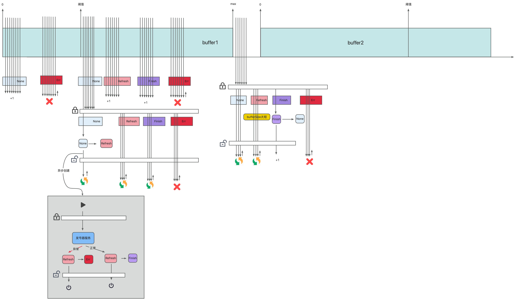

# idgen-client

发号器客户端

## 包
```shell
go get github.com/simonalong/idgen-client
```

## 配置文件
配置分为两部分
1. 发号器服务端连接配置： 
   - 直连模式：开发调试时候用
   - 注册中心模式：上线时候用
2. 业务的配置

### 连接服务端

#### 直连模式
开发调试用
```yaml
# 发号器服务端配置（直连模式）
gole:
  grpc:
    enable: true
    cbb-mid-srv-idgen:
      host: cbb-mid-srv-idgen
      port: 2091
      
# 业务配置：发号器业务使用
cbb:
  idgen:
    service_name: idgen_client_test # 服务名（少于64个字符）
    modules:
      - module: test_module1   # 业务对应的模块（少于64个字符）
        buffer_size: 10         # buffer大小，最少为10
      - module: test_module2
        buffer_size: 10     
```

#### 注册中心
正式业务用
```yaml
# 发号器服务端配置（注册中心模式）
gole:
  grpc:
    enable: true
    register:
      enable: true
      url: nats://aiot-nats:4222
      user-name: admin
      password: admin-demo123@xxxx.com
    cbb-mid-srv-idgen:
      # 服务端在注册中心注册的服务名列表
      service-name: cbb-mid-srv-idgen
      connect-params:
        # MinConnectTimeout是我们愿意提供连接完成的最短时间。
        min-connect-timeout: 10s
# 业务配置：发号器业务使用
cbb:
  idgen:
    service_name: idgen_client_test # 服务名（少于64个字符）
    modules:
      - module: test_module1   # 业务对应的模块（少于64个字符）
        buffer_size: 10         # buffer大小，最少为10
      - module: test_module2
        buffer_size: 10     
```

## 代码使用
就两类函数
- NewClient：初始化函数（读取application.yaml中的配置）
- NewClientWith：初始化函数（手动配置）
- GetId：获取id函数
- GetIdOfBase62：获取id函数，返回base62编码的id，其中base62其实是id压缩之后的编码，减少id长度，最大字符串长度为11个字符
```go
func NewClient() (*IdClient, error) {}
func NewClientWith(ServiceBufferConfig *ServiceBufferConfig) (*IdClient, error) {}

func (idClient *IdClient) GetId(module string) (int64, error) {}
func (idClient *IdClient) GetIdOfBase62(module string) (string, error) {}
```
示例：
```go
import (
    idgen "github.com/simonalong/idgen-client"
)

func TestIdgen(t *testing.T) {
    // 初始化
    idClient, err := idgen.NewClient()
    if err != nil {
        logger.Errorf("初始化异常：%v", err)
        return
    }

    // 获取id
    id, err := idClient.GetId("test_module1")
    if err != nil {
        logger.Errorf("获取id失败：%v", err)
        return
    }
    fmt.Println(id)
}
```
## 并发度测试
- bufferSize: 10，   单节点最大是 1,100/s
- bufferSize: 100，  单节点最大是 2,500/s
- bufferSize: 1000， 单节点最大是 27,000/s
- bufferSize: 10000，单节点最大是 900,000/s

说明：
系统每次启动会重新获取buffer，如果buffer选择过大，则每次启动会浪费更多，因此请业务根据自身并发量自行选择合适的bufferSize
## 原理
双buffer切换

